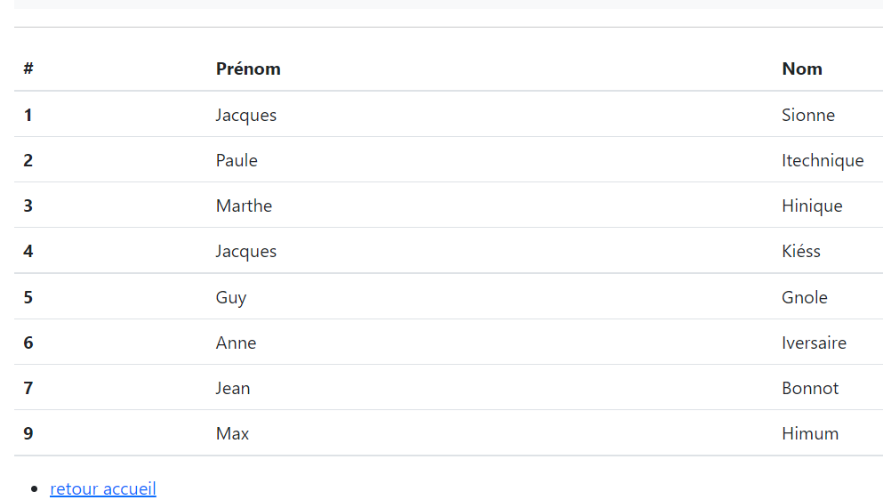
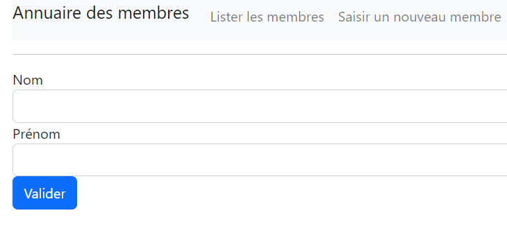
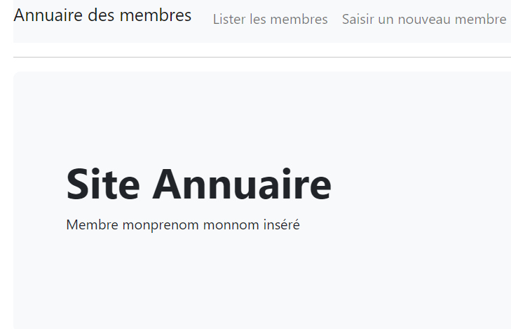
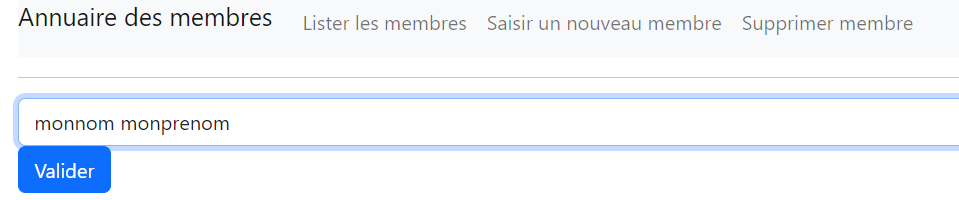
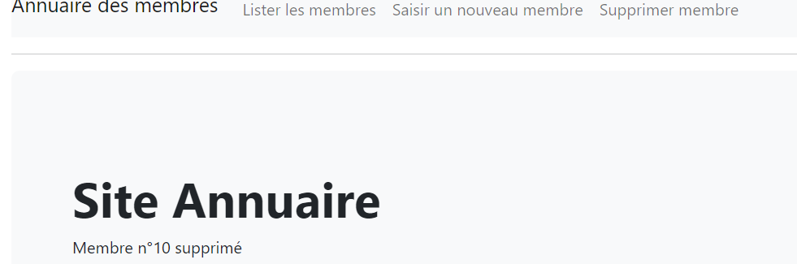

# 1 - Annuaire version étudiant
Un club de bridge a souhaité créer une application pour recencer tous ses membres lors d'une compétition. 
Un étudiant en informatique a durant son stage créer un debut d'application.  
Les caractéristiques sont les suivantes :
1. Langage : PHP, HTML, CSS
2. Pattern :  MVC
3. Framework css : [Bootstrap](https://getbootstrap.com/docs/5.2/getting-started/introduction/)
Pour l'instant cette application est locale. 

## Mission 1 : Installation de l'application
1. Faire un clone du repository 
> git clone https://github.com/chchabin/annuaire-VerEtudt.git
2. Lancer le script `annuaire.sql`
3. Lisez la partie 2 pour comprendre les principes du MVC.


## Mission 2 : Création de la fonctionalité liste membre
#### a - Maquette
La maquette de la vue `v_listemembres.php` doit avoir cette apparence :
 

#### b - Fiches descriptives du cas d'utilisation à réaliser

| **PROJET :**   Application  web de afficher membre                               | 
|----------------------------------------------------------------------------------|
| **Description cas d’utilisation**                                                |
| **Nom cas d’utilisation :**   Saisir les membres                                 |
| **Acteur déclencheur :**   l’utilisateur                                         |
| **Scénario nominal :**                                                           |
| 1. L’utilisateur demande à saisir un membre.                                     |
| 2. Le système retourne le formulaire de saisie                                   |
| 3. L’utilisateur saisit les informations et valide sa saisie.                    |
| 4. Le système retourne la vue accueil avec l'information sur l'etat de la saisie |
| **Extensions :**                                                                 |
| **Exceptions :**                                                                 |
### c- fiches savoir
[framework bootstrap](https://getbootstrap.com/docs/5.2/getting-started/introduction/)  
[la boucle foreach](http://chchabin.free.fr/php/php034ProgPhp_Boucles.html#bouclesforeach)  
[les tableaux associatifs](http://chchabin.free.fr/php/php033ProgPhp_Tableaux.html#tableauAssociatif)  

**Ce qui vous est demandé de faire :**
1. dans le fichier `m_model.php` trouvez la requête qui récupère tous les noms et prénom des membres.
2. Testez votre résultat.
3. dans le fichier `v_listemembres.php` construisez un tableau HTML et remplissez les lignes dynamiquement à partir de la variable `$les_membres` qui envoyée par le contrôleur.

## Mission 3 : Création de la fonctionalité saisir membre
#### a - Maquette
La maquette de la vue doit avoir cette apparence :  

La maquette de résultat doit avoir cette apparence:

#### b - Fiches descriptives du cas d'utilisation à réaliser

| **PROJET :**   Application  web de afficher membre                               | 
|----------------------------------------------------------------------------------|
| **Description cas d’utilisation**                                                |
| **Nom cas d’utilisation :**   Saisir les membres                                 |
| **Acteur déclencheur :**   l’utilisateur                                         |
| **Scénario nominal :**                                                           | 
| 1. L’utilisateur demande à saisir un membre.                                     |
| 2. Le système retourne le formulaire de saisie                                   |
| 3. L’utilisateur saisit les informations et valide sa saisie.                    |
| 4. Le système retourne la vue accueil avec l'information sur l'etat de la saisie |
| **Extensions :**                                                                 |
| **Exceptions :**                                                                 |
### c- fiches savoir
[framework bootstrap](https://getbootstrap.com/docs/5.2/getting-started/introduction/)  
[les formulaires](http://chchabin.free.fr/php/php044Transmission.html#transmissionFormRecup)

**Ce qui vous est demandé de faire :**
1. dans le fichier `m_model.php` créez la fonction `insertMembre()` pour insérer un nouveau membre dans la base de données.
2. dans le fichier `v_saisiemembre.php` et construisez un formulaire avec le nom et le prénom à saisir.
3. modifiez le cas `controlesaisie` dans le contrôleur pour récupérer toutes les variables.
4. modifiez le message envoyé par le contrôleur dans la vue `accueil.php`.


## Mission 4 : Création de la fonctionalité supprimer membre
>Les membres seront supprimés un par un.
#### a - Maquette
La maquette de la vue doit avoir cette apparence :   

La maquette de résultat doit avoir cette apparence:



#### b - Fiches descriptives du cas d'utilisation à réaliser

| **PROJET :**   Application  web de afficher membre                               | 
|----------------------------------------------------------------------------------|
| **Description cas d’utilisation**                                                |
| **Nom cas d’utilisation :**   Supprimer un membre                                |
| **Acteur déclencheur :**   l’utilisateur                                         |
| **Scénario nominal :**                                                           | 
| 1. L’utilisateur demande à supprimer un membre.                                  |
| 2. Le système retourne le formulaire de saisie                                   |
| 3.  L’utilisateur choisi le membre et valide sa saisie.                          |
| 4. Le système retourne la vue accueil avec l'information sur l'etat de la saisie |
| **Extensions :**                                                                 |
| **Exceptions :**                                                                 |
### c- fiches savoir
[framework bootstrap](https://getbootstrap.com/docs/5.2/getting-started/introduction/)  
[les formulaires](http://chchabin.free.fr/php/php044Transmission.html#transmissionFormRecup)  
[formulaire et select](http://chchabin.free.fr/php/php044Transmission.html#transmissionFormSelect)

**Ce qui vous est demandé de faire :**                                 
1. dans le fichier `m_model.php` créez la fonction `deleteMembre()` qui prendra en paramètre l'id du membre,
2. créez un fichier `v_deletemembre.php` dans lequel l'utilisateur chois le membre à supprimer dans une liste, puis valide la suppression,
3. dans le contrôleur, créez le cas `supprimer` qui affiche la vue `v_deletemembre.php`,
4. testez votre travail,
5. dans le contrôleur, créez le cas `controledelete` pour récupérer les informations du formulaire et lancer la suppression dans le modèle.
6. Affichez le résultat de la saisie dans la vue `accueil.php` (prevoyez le code dans le cas `controledelete` en conséquence).
   pression
# 2- Quelques explications

## a - Point d'entrée unique
Le fichier `index.php` va lire toutes les url lancées par l'utilisateur.  
Il faut distinguer 2 cas :
1. l'application se lance pour le **première fois**, dans ce cas les paramètres de l'url sont fixées par avance
2. l'utilisateur clique sur un lien du menu, l'url obtenu sera de la forme
>adresse du site/index.php?uc=nomcontroleur&action=nomaction

Par exemple vous pouvez avoir l'URL suivante si vous cliquez sur `Lister les membres` 
> http://localhost/annuaire-VerEtudt/index.php?uc=gerer&action=lister
## La gestion de l'url
Le fichier index.php va orienter le flux vers le contrôleur qui généralement est le fichier
>c_gerer.php  

Dans le contrôleur, le programme exécutera la fonction correspondant au nom de l'action. Ici l'action est appelée via un `switch`

## b - L'écriture de l'action dans le contrôleur
L'action va obtenir des données du modèle. Elle va les traiter et les envoyer à une vue. Voici un exemple
```php
        $les_membres=$pdo->getLesMembres(); // Appel de la fonction dans le modèle
        require 'views/v_listemembres.php'; // Appel de la vue à afficher
```
## c - Le modèle
Le modèle enregistre toutes les données, qu'elles viennent d'une base de données ou d'un tableau.  
Dans le cas d'une base de donnée elle rassemblera toutes les requêtes nécessaires à la fourniture de données.
Dans notre cas c'est la fonction `getLesMembres()` qui est appelée :
```php
    public function getLesMembres()
    {
        $sql = ''; // Requête à créer
        $req = PdoBridge::$monPdo->prepare($sql);
        $req->execute();
        $d = $req->fetchALL(PDO::FETCH_ASSOC);
        return $d;
    }
```
## d - La vue
Elle reçoit les données et le met en forme selon les besoins du client.
Ici c'est la vue `v_accueil` qui est appelée. Ele récupère les données de la variable `$message`
```php
<div class="p-5 mb-4 bg-light rounded-3">
    <div class="container-fluid py-5">
        <h1 class="display-5 fw-bold">Bienvenue</h1>
        <p><?php echo $message; ?></p>
    </div>
</div>
```
>**ATTENTION**  
> Ici le nom de la variable doit être identique dans l'action et dans la vue !